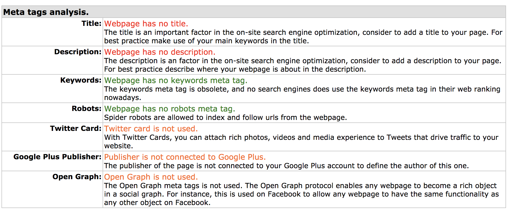

# How bad is it? 
So you just created a Gatsby website and you're pretty happy with the layout, you've added a couple of fresh blog posts and it's all running pretty smoothly. But what about SEO? Will people be able to find your blog or click on it if they find it through a search engine? Well, I was asking myself the same question about a week ago, so I'm going to walk you through my strategies for figuring out just how bad the SEO on my website was and what I did to fix it.

First, I did a bit of digging on modern SEO techniques and I found a list of potential things to look at:
* Meta tags and helmet
* Alt to images 
* Headings size 
* Backlinks
* Keywords (1, 2, 3 words)
* Broken links
* Typos?

Alright, but let's see what we have so far, maybe Gatsby came up with some magic that we are not aware of. Spoiler alert: it didn't. So I found [a meta tag analyzer](https://www.seocentro.com/tools/search-engines/metatag-analyzer.html) and looked at the results. It was pretty bad. I felt like I was being told off by a website.

But we did get a couple of hints on other things we need to do:
* Robots
* Twitter (and presumably other social websites) cards
* Open Graph

Here is what [Site Checker](https://sitechecker.pro/) (another SEO free tool) told me.

It told me some of the same things as the one above, but I got a couple of extra leads (we'll discuss these in more detail later on so don't worry if you have no idea what they mean):
* Redirects
* Canonical URLs
* Anchors on external links 
* Mobile optimization 

I also tried to use [Google Search Console](https://search.google.com/search-console) but it takes a few days for Google to index the site and given I've just published it I couldn't see any data. 

I also tried [Website Grader](https://website.grader.com) and surprisingly it gave me **27/30** on Performance, **30/30** on Mobile, **10/10** on Security and (here it goes) **5/30** on SEO. Some more hints:
* Sitemap
* Render blocking

# SEO checklist
To combine everything we found in the previous section, here is our checklist of things to do to make Google (and other search engines, trying to be inclusive here) love us ~~more~~. I've ordered them by priority.

1. Meta tags and helmet -> PART 2
1. Twitter (and presumably other social websites) cards
1. Canonical URLs
1. Redirects
1. Open Graph
1. Alt text to images 
1. Robots
1. Sitemap
1. Headings size 
1. Anchors on external links 
1. Backlinks
1. Keywords (1, 2, 3 words)
1. Broken links
1. Mobile optimization (+ Render blocking)
1. Typos

# What now?
So far we haven't done anything with gatsby specifically, but that's because we were figuring out what to do. Next we are going to pick off one item at a time from the list and apply it to our gatsby website. 

Stay tuned!