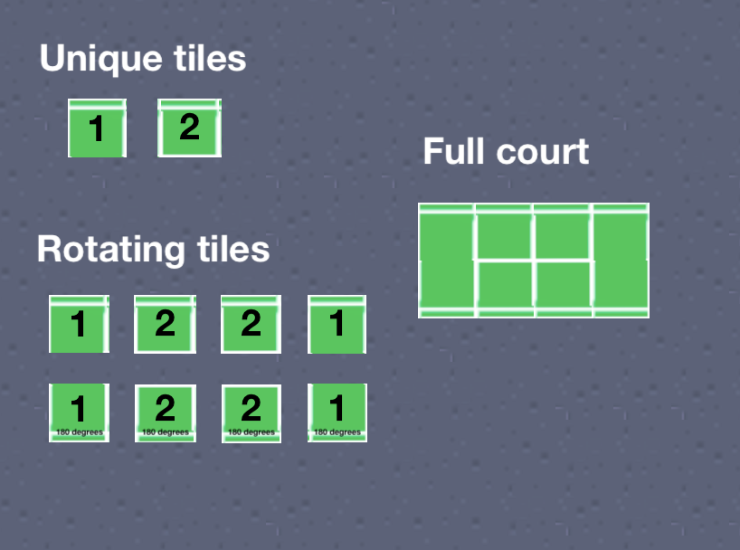
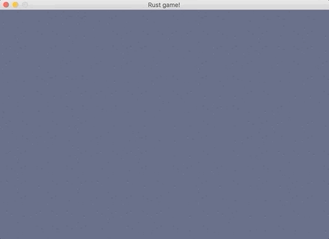

In this post I'll talk about a small game I've been developing in about 24 hours in total (mostly in a few hour blocks during evenings or weekends). The game is far from finished, but I thought I'd write up about my experience so far, what I've learnt and some interesting observations about building a game from scratch-ish and doing it in Rust. 

## Why Rust?
I picked Rust because I've been hearing great things about it and I see it's been getting some traction in the game development space. I have to say at the point which I started this game I had written a few small programs in Rust, just enough to not feel like my hands were tied when I started writing the game. 

## Why a game and what game?
Making games is fun! I wish there was a more elaborate reason than that, but for side projects I normally prefer things that are quite far from what I do daily at my job. Now, what game? I wanted to make a simulation game with a tennis theme, think like Cities Skylines meets Zoo Tycoon meets Prison Architect with tennis and pixel art. I haven't got it all figured out yet, but it's basically a tennis academy where people come and play tennis.

## Tech research
I knew I wanted to use Rust, but I didn't know exactly how much "from-scratch" I wanted to make it. I didn't want to write pixel shaders, but I didn't want to use drag and drop either, so I had to pick something that gave me enough flexibility but also keep it interesting from an engineering perspective without going too low level. 

I found a few useful resources which I'll link here in case you want to have a look: 
* [Are we game yet](http://arewegameyet.com/) - a list of game dev related Rust packages
* [Rust game dev subreddit](https://www.reddit.com/r/rust_gamedev)
* [Free pixel art](https://kenney.nl)

I did a little research on Rust game engines and was left with two main contenders: Piston and ggez. I tried both in a previous small project and I ended up going with ggez because it seemed easier to use for a small 2D game. Piston's modularity seemed a bit unapproachable from a beginner's point a few.

## The basic game design
I then spent a bit of time thinking about the game. The first step would be to have some floor on the screen, then some people, then some courts. Eventually, we'll need to assign people to courts, have them move there and waaay in the future, the people would have skills which would improve the more they play. There would need to be a sort of build mode so you can add people and courts and eventually all this would cost money.

At this point I felt like I had enough ideas to start coding. (being PM and dev is quite fun! I'd still rather have a PM though ..)

### The beginnings: circles and abstraction
I pretty much ripped off a ggez sample and got a window with a circle in it up on the screen. Amazing! Next, some abstraction. I thought it would be a good idea to abstract the idea of a game object. Every game object can be rendered and updated, something like this (if you're rolling your eyes at this point, this was before I found out about ECS, so bear with me here). 

```rust
// the game object trait
trait GameObject {
    fn update(&mut self, _ctx: &mut Context) -> GameResult<()>;
    fn draw(&mut self, ctx: &mut Context) -> GameResult<()>;
}

// a specific game object - Circle
struct Circle {
    position: Point2,
}

 impl Circle {
    fn new(position: Point2) -> Circle {
        Circle { position }
    }
}
impl GameObject for Circle {
    fn update(&mut self, _ctx: &mut Context) -> GameResult<()> {
        Ok(())
    }
    fn draw(&mut self, ctx: &mut Context) -> GameResult<()> {
        let circle =
            graphics::Mesh::new_circle(ctx, graphics::DrawMode::Fill, self.position, 100.0, 2.0)?;

         graphics::draw(ctx, &circle, na::Point2::new(0.0, 0.0), 0.0)?;
        Ok(())
    }
}
```

This allowed me to have a nice list of objects which I could update and render in a nice loop. 

```rust
impl event::EventHandler for MainState {
    fn update(&mut self, context: &mut Context) -> GameResult<()> {
        // Update all objects
        for object in self.objects.iter_mut() {
            object.update(context)?;
        }

        Ok(())
    }

    fn draw(&mut self, context: &mut Context) -> GameResult<()> {
        graphics::clear(context);

        // Draw all objects
        for object in self.objects.iter_mut() {
            object.draw(context)?;
        }

        graphics::present(context);

        Ok(())
    }
}
```

At this point `main.rs` was the place to be, because every single line of code was there, so I spent some time breaking that up into separate files and rationalizing the directory structure a bit, so it looked like this now. 

```
resources -> this is where all the assets are (images)
src
-- entities
---- game_object.rs
---- circle.rs
-- main.rs -> main loop 
```

### People, floors and images
The next big milestone was creating a `Person` game object and loading images. I decided everything will be tile based (currently 32x32 tiles).


### Tennis courts
I spent some time looking at images of tennis courts online and I figured I'd want my tennis court to be 4*2 tiles. I would make an image that wide, or I could have 8 separate tiles. On further inspection I actually realized I only need 2 unique tiles to build the whole court. Let me explain. 

2 unique tiles: 1 and 2. 

Each section of the court is actually made up of either tile 1 or tile 2, either as is or rotated 180 degrees. 



### A basic build mode
Now that I could render floors, people and courts I figured I needed a basic build mode. I made it so that when a key was pressed, an object was selected and click would then place that type of object. For example, pressing 1 would give you a court and pressing 2 would give you a person.

That wasn't super useful as you needed to remember what 1 or 2 were, so I added a build-mode wireframe so you could at least know what object you had. Here it is in action.



### Questioning the architecture and refactoring
I now had a few game objects: people, courts and floors. But in order to make the wireframes work I had to let every entity know if it was in wireframe mode and then in every draw call the entity would have to check if it was in wireframe mode and if it was draw a bounding box instead of an image. This didn't really feel right.

I started questioning the architecture and I could see some clear limitations:
* Having every entity render and update itself was problematic - the entity wouldn't know if it should render an image or a wireframe
* I had no good way of sharing properties and behaviour between entities - for example the `is_build_mode` property and draw behaviour. I could use inheritance (but Rust didn't have a very good way of doing this), but what I really want is composition.
* I had no good way of having entities interact with eachother - which I definitely needed later in order to assign people to courts
* The entities were mixing data and logic, which would very quickly get out of hand

I did a bit more research and I found something called [ECS - Entity Component System](https://en.wikipedia.org/wiki/Entity_component_system) architecture which is mostly used in games. The gist of ECS is this:
* separate data from logic
* composition over inheritance
* data oriented design

In ECS terminology you have these 3 basic concepts:
- Entities: this is just a type of a thing referenced with an identifier (like a Player, Ball, etc.)
- Components: these are what your entities are made up of. For example, you can have a Renderable component, a Position component, etc. This is purely data storage.
- Systems: systems use entities and components and contain behaviour and logic based on that data. For example, you could have a rendering system which just iterates through all entities which contain renderable components and draws all of them.

The more I read about this the more I realized it would solve my current problems:
* I could use composition over inheritance to break things out in a more systematic way
* I could use systems to control behaviour without ending up with spaggheti code
* I could share things like `is_build_mode` and have that wireframe logic in one place (in the rendering system). 

Here is what I ended up with after implementing ECS (which in fairness, was pretty much a rewrite).

```
resources -> this is where all the assets are (images)
src
-- components
---- position.rs
---- person.rs
---- tennis_court.rs
---- floor.rs
---- wireframe.rs
---- mouse_tracked.rs
-- resources
---- mouse.rs
-- systems
---- rendering.rs
-- constants.rs
-- utils.rs
-- world_factory.rs -> world factory functions 
-- main.rs -> main loop 
```


